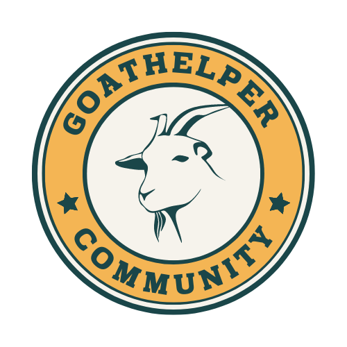

<h1 align="center">goat_seo_assistant</h1>

<p align="center">
    
</p>

The IA Assistant to scale your process to define the special descriptions, meta tags and much more to launch your web page.

## TO START

To start we need a basic congiguration to set the Open API api key.

``` bash
export OPENAI_API_KEY='[Your API Key]'
```
> or add the line in your `~/.bashrc` file
